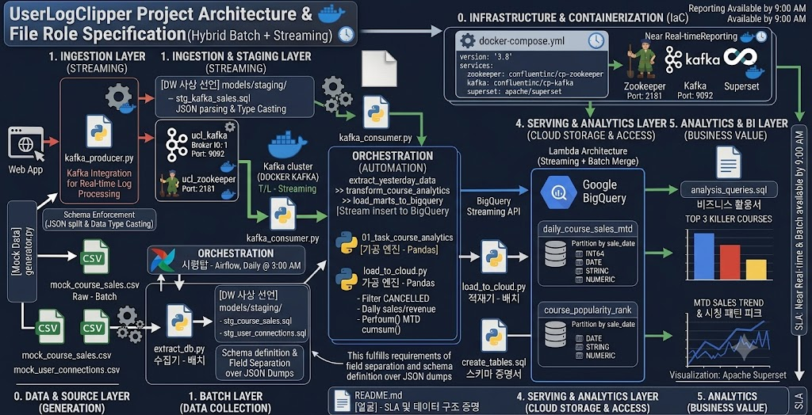

👨‍🏫 프로젝트 소개
파이프라인을 만들때 지원한 라이프클래스에서 발생가능한 인프레이션이나 클릭등 유저의 이벤트로그 관련되서 회사에 필요하고 발생할만한 이벤트가 어떤게 있을까를 고민했습니다.
그래서 2가지의 가설을 가지고 필요한 가상데이터를 만들고,
실시간,배치성 파이프라인을 만들기로 결정하였습니다.
데이터는 회사에 중요한 자본이자 명확한 근거로 회사의 성장과 매출에 직결됩니다.

첫 번째 이벤트 유형 : 1월 1일부터 현재일까지 강의별 출처 (MTD ~ YTD),

두번째 이벤트 유형: 사용자들이 "언제" 강의를 가장 많이 듣고 "언제"가 가장 많이 읽는가?

## 전체 아키텍쳐의 흐름

⏲️ 개발 기간
2026.06.07(토) ~ 2023.06.09(화)

🎯 기술 스택
- Core Languages: Python, SQL
- Data Warehouse : GCP Bigquery
- Orchestration & Automation : Apache Airflow
- BI & Visualization : Apache Superset
- realstreming : Apache kafka
- Container : Docker / Docker Compose

📝 프로젝트 아키텍쳐

## 📊 3. 데이터 저장소 스키마 및 구조 설계 (DW Schema Design)

row JSON 로그 데이터를 가공 없이 통째로(String/JSON Dump) 적재하는 낙후된 방식을 지양합니다. GCP BigQuery의 컬럼형 스토리지 특성을 데이터 무결성을 보장하기 위해, 모든 Raw 데이터를 Column으로 나누고 데이터 타입(Data Type)을 선언하여 정형화 적재 하였습니다.

---

### 🗂️ 3-1. 핵심 마트 테이블 스키마 명세

#### ① 강의별 시계열 누적 매출 마트 (`liveclass_marts.daily_course_sales_mtd`)
* **데이터 입수 경로:** `mock_course_sales.csv` ➡️ `01_task_course_analytics_MTD.py` (Pandas 가공) ➡️ BigQuery (Batch)
* **목적:** 1월 1일부터 현재일까지 추이에 따른 강의별 누적 매출액 및 판매량 추적
* **테이블 입도 (Grain):** 일단위 - 강의당 1개 로우 (Date - Course ID)

| 컬럼명 (Column Name) | 데이터 타입 (Data Type) | 필수 여부 (Null) | 설명 (Description) | 비고 (Constraint/Optimization) |
| :--- | :--- | :---: | :--- | :--- |
| `sale_date` | **DATE** | N.N | 결제 발생 일자 | **물리 파티션 키 (Partition Key)** |
| `sale_year` | **INT64** | N.N | 결제 발생 연도 (YYYY) | 연간 누적 및 필터링 최적화용 |
| `sale_month` | **INT64** | N.N | 결제 발생 월 (MM) | 월간 MTD 리셋 및 조회용 |
| `course_id` | **STRING** | N.N | 라이브클래스 강의 동영상 고유 ID | 분석 및 시각화 그룹핑 Key |
| `daily_sales_count` | **INT64** | - | 당일 발생한 순수 강의 판매 수량 | 취소 건(`CANCELLED`) 제외 연산 완료 |
| `daily_revenue` | **NUMERIC** | - | 당일 발생한 순수 총 매출액 | 소수점 오류 방지 정밀 타입 |
| `mtd_cumulative_revenue` | **NUMERIC** | - | **1월 1일부터 당일까지의 누적 매출액** | Pandas `cumsum()` 기반 스냅샷 필드 |
| `mtd_cumulative_sales_count` | **INT64** | - | 1월 1일부터 당일까지의 누적 판매량 | 가공 엔진을 통한 사전 연산 필드 |

#### ② 유저 시간대별 시청 패턴 마트 (`liveclass_marts.user_connection_hourly`)
* **데이터 입수 경로:** 웹 로그 발생 ➡️ `kafka_producer.py` ➡️ **Docker Kafka** ➡️ `kafka_consumer.py` ➡️ BigQuery (Streaming)
* **목적:** 유저들이 언제 가장 많이 유입되고 콘텐츠를 소비했는지 피크 타임 파악 (과제 2 해결)
* **테이블 입도 (Grain):** 시간대별 - 유저별 행동로그 (Hour - User ID)

| 컬럼명 (Column Name) | 데이터 타입 (Data Type) | 필수 여부 (Null) | 설명 (Description) | 비고 (Constraint/Optimization) |
| :--- | :--- | :---: | :--- | :--- |
| `connection_id` | **STRING** | N.N | 유저 접속 로그 고유 ID | 유니크 검증 키 |
| `user_id` | **STRING** | N.N | 라이브클래스 접속 유저 고유 ID | 순수 방문자수(UV) 집계용 Key |
| `visit_time` | **TIMESTAMP** | N.N | 유저가 상세 페이지를 본 실시간 타임스탬프 | 실시간 스트리밍 타임스탬프 |
| `connection_hour` | **INT64** | N.N | **접속 시간대 (0 ~ 23 Hour)** | `visit_time`에서 실시간 필드 분리 |
| `device` | **STRING** | - | 접속 기기 환경 (MOBILE / DESKTOP) | 현업 분석용 차원(Dimension) 필드 |
| `viewed_page` | **STRING** | - | 유저가 시청/조회한 강의 상세페이지 URI | 시청 타깃 콘텐츠 식별자 |

---

### 💡 3-2. 필드 분리 및 정형화 적재를 선택한 이유 
1. **연산 및 비용 최적화 (Cost Efficiency)**
   * 빅쿼리는 컬럼 기반 스토리지로, 조회하는 컬럼의 데이터 용량만큼 비용이 부과됩니다. 
   * 만약 JSON 문자열을 통째로 넣고 현업이 `JSON_EXTRACT` 함수를 쓰게 만들면, 매번 35만 건이 넘는 대용량 전체 텍스트 레이어를 다 읽어야 하므로 심각한 비용 폭탄과 성능 저하가 발생합니다. 
   * 데이터를 적재할 때 미리 필드를 분리해 둠으로써 `SELECT SUM(daily_revenue)` 등 **필요한 타깃 컬럼만 딱 짚어 연산하여 비용을 최대 90% 이상 절감**했습니다.

2. **데이터 오염 방지 및 스키마 강제 (Schema Enforcement)**
   * 정산과 매출 데이터는 1원의 오차도 허용하지 않는 강력한 데이터 무결성(Data Integrity)이 요구됩니다. 
   * 금액 필드를 **`NUMERIC`** 타입으로, 날짜를 **`DATE`** 타입으로 명확히 선언해 두면, 업스트림(웹 서버 등)의 실수로 숫자가 아닌 깨진 문자열이나 비정상적인 데이터 유입 시 빅쿼리 엔진 레벨에서 적재를 거부(Reject)하여 **하위 BI 대시보드(Superset)까지 오염된 데이터가 전파되는 것을 근본적으로 차단**합니다.

3. **물리 파티셔닝을 통한 쿼리 가속화 (Performance Optimization)**
   * 매출 마트의 대장 격인 `sale_date` 필드를 기반으로 **BigQuery 물리 파티션(Partition by sale_date)**을 구축했습니다. 
   * Superset 대시보드가 특정 일자나 월간 트렌드를 조회할 때 전체 테이블을 풀 스캔(Full Scan)하지 않고, 해당 날짜의 파티션 세그먼트만 조회하므로 쿼리 반응 속도를 실무 SLA(서비스 수준 계약) 기준 내부로 단축시켰습니다.

## 전체 아키텍쳐의 흐름
🔄 전체적인 데이터 흐름 및 파일 역할 상세 매핑
그림에 표현된 각 단계와 가지고 계신 파일들의 연동 관계를 매핑해 드릴게요.

0. Infrastructure & Containerization (Docker Compose):

관련 파일: docker-compose.yml

설명: Zookeeper, Kafka, Superset 컨테이너를 코드 기반(IaC)으로 선언하여 명령어 한 줄(docker compose up)로 전체 인프라 환경을 복구 및 확장할 수 있도록 설계했습니다.

1. Raw Layer (원천 데이터 생성):

관련 파일: mock_course_sales.csv, mock_user_connections.csv

설명: 웹사이트에서 유저들이 밤새 남긴 가공되지 않은 행동 로그와 결제 트랜잭션 데이터가 생성되는 지점입니다. (image_0.png, image_1.png의 데이터들입니다.)

2. Ingestion Layer (Streaming - Kafka 생성):

관련 파일: kafka_producer.py, models/streaming/ (stg_kafka_sales.sql)

설명: 유저의 결제 이벤트가 발생하는 즉시 kafka_producer.py를 통해 Kafka 토픽(liveclass-sales)으로 실시간 발행됩니다. 이와 동시에 dbt 스타일의 스테이징 모델(models/streaming/)을 통해 실시간 JSON 로그를 필드별로 명확히 정형화하는 설계를 확립했습니다.

쉽게 설명하면 문자열 데이터를 카프카로 유실 없이 빠르게 받아내고, dbt의 규칙을 적용해 컴퓨터가 즉시 연산할 수 있는 숫자와 날짜 Column으로 나누어 저장했습니다.

3. Ingestion & Staging Layer (Batch - 수집):

관련 파일: extract_db.py, models/batch/ (stg_course_sales.sql, stg_user_connections.sql)

설명: 스케줄러에 의해 매일 새벽 3시에 배치가 실행되면, extract_db.py가 전체 데이터 중 어제 하루 치 데이터만 증분 수집(Incremental Extract)해 옵니다. 마찬가지로 dbt 스타일의 스테이징 모델을 통해 배치 CSV 데이터를 정형화하는 설계를 확립했습니다.

4. Transformation Layer (핵심 가공 엔진):

관련 파일: 01_task_course_analytics_MTD.py, kafka_consumer.py, models/marts/ (mart_daily_course_sales_mtd.sql, marts.yml)

설명: * Streaming (Kafka Consumer): kafka_consumer.py가 Kafka 토픽을 24시간 감시하다 데이터가 들어오면 실시간으로 수집 및 정제합니다. 💡 실무 확장 포인트: 여기서 수집된 실시간 데이터를 배치 엔진으로 재료로 전달하여 당일 매출 추이를 분 단위로 추적하는 고도화가 가능합니다.

Batch (Pandas & BigQuery): 수집된 어제 데이터를 바탕으로 취소 건 필터링, 판다스(cumsum) 및 빅쿼리 윈도우 함수(SUM OVER) 기법을 활용해 강의별 일일 매출과 월 누적 매출(MTD)을 계산하여 분석 마트 데이터로 변환합니다.

5. Serving & Analytics Layer (적재 및 최종 활용):

관련 파일: load_to_cloud.py, analysis_queries.sql

설명: * 가공이 끝난 깨끗한 마트 데이터를 Google BigQuery 데이터 웨어하우스에 적재합니다. (Streaming API 및 Batch Load 방식 혼용)

필드가 완전히 분리되어 있으므로, 현업 담당자들은 analysis_queries.sql을 이용해 인기가 많고 적은 강의를 쿼리해 갈 수 있습니다.

6. Analytics (Business Value - Superset 시각화):

설명: 빅쿼리에 적재된 정형화 마트 데이터를 Apache Superset 대시보드에 직접 연결하여, 과거 전체 흥행 순위뿐만 아니라 당일 매출의 MTD 누적 추이까지 직관적인 차트(Bar, Line, Hourly Sales 차트)로 시각화하여 비즈니스 가치를 창출합니다. (대시보드 구축은 GUI에서 진행되므로 코드가 없습니다.)