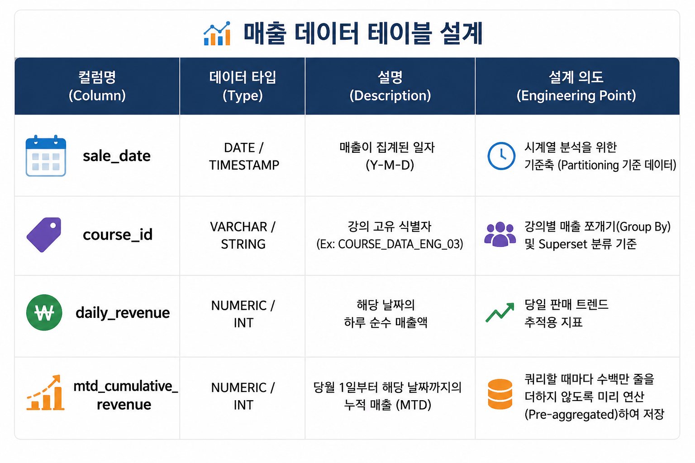
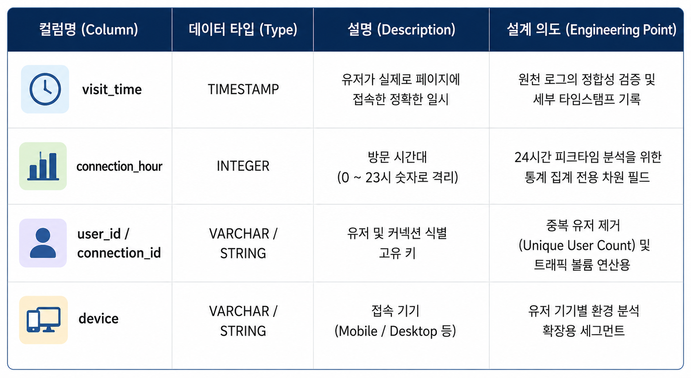

👨‍🏫 프로젝트 소개

파이프라인을 만들때 지원한 라이프클래스에서 발생가능한 인프레이션이나 클릭등 유저의 이벤트로그 관련되서 회사에 필요하고 발생할만한 이벤트가 어떤게 있을까를 고민했습니다.
그래서 2가지의 가설을 가지고 필요한 가상데이터를 만들고,
실시간,배치성 파이프라인을 만들기로 결정하였습니다.

첫 번째 이벤트 유형 : 1월 1일부터 현재일까지 강의별 매출 (MTD ~ YTD),

두번째 이벤트 유형: 하루중 사용자들이 "언제" 강의를 가장 많이 듣고 "언제"가 가장 적게 듣는가?

## 전체 아키텍쳐의 흐름

⏲️ 개발 기간
2026.06.07(토) ~ 2023.06.09(화)

🎯 기술 스택
- Core Languages: Python, SQL
- Data Warehouse : GCP Bigquery
- Orchestration & Automation : Apache Airflow
- BI & Visualization : Apache Superset
- realstreming : Apache kafka
- Container : Docker / Docker Compose

📝 프로젝트 아키텍쳐

[Raw Layer] ──> 1) 실시간 로그  ──> [Kafka Stream] ──> [Consumer/dbt stg] ──> [BigQuery Marts] ──> [Apache Superset]
            ──> 2) 일일 결제배치 ──> [Extract/dbt stg] ──> [Pandas/cumsum]   ──┘ (Storage & Serving)
                 (Visualization)

실시간 스트리밍 라인 (Streaming Pipeline):
유저가 행동 로그를 남기는 즉시 Kafka Producer를 통해 이벤트가 발행되며, Kafka Consumer가 이를 24시간 실시간으로 감지하고 정제합니다. 비정형 JSON 로그는 dbt 스타일의 스테이징 구조를 거쳐 즉시 연산 가능한 정형 데이터로 분리된 후 빅쿼리에 스트리밍 적재됩니다.

일일 증분 배치 라인 (Batch Pipeline):
매일 새벽 3시, Airflow 환경을 모킹한 스케줄러에 의해 load_to_cloud.py.py가 가동됩니다. 전체 데이터를 매번 풀 스캔(Full Scan)하는 비용 낭비를 지양하고, 어제 하루 치의 변경 사항만 가져오는 증분 수집 방식을 채택했습니다. 수집된 데이터는 Pandas의 cumsum() 연산을 통해 일일 매출 및 월 누적 매출(MTD) 마트로 변환되어 빅쿼리에 적재됩니다.

🛠️ 실행 방법 

본 인프라는 Docker Compose 기반의 IaC로 관리되므로, 명령어 몇 줄로 전체 파이프라인 환경을 로컬에 즉시 구동할 수 있습니다.

#### 1) 필수 도구 설치
Docker - Docker Desktop 
Python 3.10+ 및 가상환경 (`.venv`)

#### 2) 인프라 컨테이너 구동 (Kafka, Zookeeper, Superset)

📝 스키마 설명

일별 강의 매출 및 월 누적 매출 스키마 (mart_daily_course_sales_mtd)

sale_date (매출 집계 일자)

날짜별로 매출이 어떻게 변하는지 봐야되기때문에 필요함.
course_id (강의 고유 식별자)

전체 매출을 통째로 보여주려면 어떤강의가 효자상품인지 확인하려면 강의 고유 식별자가 필요함(분류기준의 역활 Dimension 역할도 할수있음)
daily_revenue (하루 순수 매출액)

과거부터 지금까지 전체매출중 이강의가 차지하는 비중은 몇&일까? 라는 집계를 하기위한 하루 순수 매출액 관련된 집계가 필요함.
mtd_cumulative_revenue (월 누적 매출 - MTD)

선 그래프가 아래서부터 위로 우상향하며 뻗어나갔던 세로축(Metric) 값이 바로 이 컬럼입니다.
매일매일의 매출만 징검다리처럼 보이고, 이번 달에 누적으로 목표 매출을 달성하고 있는지 한눈에 보는 '성장 곡선'을 그릴 수 없습니다.

mtd_cumulative_revenue를 미리 계산하여 저장한 이유:

현업 담당자가 Superset 대시보드를 열 때마다 빅쿼리가 수백만,수천만 건의 과거 결제 로그를 처음부터 끝까지 다 더해서(SUM) 보여준다면, 대시보드를 새로고침 할 때마다 엄청난 비용이 청구되고 조회 속도도 느려집니다.
이를 방지하기 위해 새벽 배치가 돌 때 Pandas의 cumsum()으로 '당월 누적 매출'을 딱 한 번만 미리 계산하여 결과 스냅샷을 남기는 방식을 택했습니다.

sale_date와 course_id를 독립시킨 이유:

빅쿼리 같은 컬럼 지향(Columnar) 데이터베이스에서 가장 중요한 것은 쿼리 범위를 제한하는 것입니다. sale_date를 기준으로 파티셔닝을 수행하면 특정 날짜 범위만 골라 읽을 수 있어 비용을 아낄수 있습니다. 또한, course_id를 명확히 분리해 둠으로써 BI 툴에서 별도의 복잡한 문자열 파싱 없이 즉시 Group By를 걸어 강의별 누적 성장 곡선을 보여줄수 있도록 설계했습니다.

시간대별 유저 접속 스키마 (user_connection_hourly_marts)

visit_time (정확한 접속 일시)

유저가 정확히 몇 년, 몇 월, 몇 일, 몇 시, 몇 분, 몇 초에 들어왔는지 기록하는 원본 데이터입니다.
connection_hour (방문 시간대 - 0~23)

user_id / connection_id (고유 식별 키)

device (접속 기기 - Mobile / Desktop)

우리 플랫폼 유저들은 출근길(8시)에 주로 모바일로 들을까, 데스크톱으로 들을까?" 같은 기기별 분석 확장성을 위해 넣어둔 차원입니다.

구현하면서 고민한 점

첫번째 고민은 실시간과 배치 파이프라인의 아키텍처 분리에 대한 고민을해봤습니다.

유저가 결제 매출 데이터는 매일 새벽에 처리하는 배치 파이프라인이고,유저의 실시간 행동 로그는 카프카 기반의 스트리밍 파이프라인으로 이원하하여 흐름을 설계하는목적을 고민했습니다.

두번째로는 데이터를 증분수집 하는방식입니다.

새벽에 가동되는 배치 파이프라인이 매번 원천 데이터 베이스의 처음부터 끝까지 전체 데이터를 긁어오지않고
어제 하루동안 새로 발생한 변경사항에 대해서만 증분수집방식으로 데이터가 어떻게 들어오는지 고민했습니다.

세번째는 데이터웨어하우스의 부화를 최소화하기위해서 Superset을 사용했습니다 

Superset은 내부적으로 가벼운 메타데이터 저장소와 연동되어, 동일한 대시보드를 반복 조회할 때 빅쿼리에 매번 무거운 쿼리를 다시 날리지 않고 자체 캐싱된 데이터를 서빙하는 효율성을 보여주기에 Superset을 선택했습니다.
네번째는 비정형 JSON 스트리밍 로그 정형화 시점 고민을 했습니다

비정형 데이터를 그대로 분석 웨어하우스에 넣으면, 나중에 분석용 쿼리(GROUP BY 등)를 날릴 때마다 매번 문자열 파싱 함수를 태워야 하므로 컴퓨팅 자원과 쿼리 비용이 급격히 증가합니다. 데이터 수집(Ingestion) 단계에서 dbt의 스테이징 모델 철학을 적용해 미리 구조를 쪼개어 적재함으로써, 전체 파이프라인의 연산 효율성을 높이고 데이터 조회 비용감소를 위해 dbt스테이징 모델을 활용하였습니다.

전체 아키텍쳐의 흐름

0. Infrastructure & Containerization (Docker Compose)

- docker-compose.yml

설명: Zookeeper, Kafka, Superset 컨테이너를 코드 기반(IaC)으로 선언하여 명령어 한 줄(docker compose up)로 전체 인프라 환경을 복구 및 확장할 수 있도록 설계했습니다.

1. Raw Layer (원천 데이터 생성)

- mock_course_sales.csv, mock_user_connections.csv

설명: 웹사이트에서 유저들이 밤새 남긴 가공되지 않은 행동 로그와 결제 트랜잭션 데이터가 생성되는 지점입니다. (image_0.png, image_1.png의 데이터들입니다.)

2. Ingestion Layer (Streaming - Kafka 생성):

- kafka_producer.py, models/streaming/ (stg_kafka_sales.sql)

설명: 유저의 결제 이벤트가 발생하는 즉시 kafka_producer.py를 통해 Kafka 토픽으로 실시간 발행됩니다. 이와 동시에 dbt 스타일의 스테이징 모델(models/streaming/)을 통해 실시간 JSON 로그를 필드별로 명확히 정형화하는 설계를 확립했습니다.

쉽게 설명하면 문자열 데이터를 카프카로 유실 없이 빠르게 받아내고, dbt의 규칙을 적용해 컴퓨터가 즉시 연산할 수 있는 숫자와 날짜 Column으로 나누어 저장했습니다.

3. Ingestion & Staging Layer (Batch - 수집):

- extract_db.py, models/batch/ (stg_course_sales.sql, stg_user_connections.sql)

설명: 스케줄러에 의해 매일 새벽 3시에 배치가 실행되면, extract_db.py가 전체 데이터 중 어제 하루 치 데이터만 증분 수집(Incremental Extract)해 옵니다. 마찬가지로 dbt 스타일의 스테이징 모델을 통해 배치 CSV 데이터를 정형화하는 설계를 확립했습니다.

4. Transformation Layer:

- 01_task_course_analytics_MTD.py, kafka_consumer.py, models/marts/ (mart_daily_course_sales_mtd.sql, marts.yml)

설명: Streaming (Kafka Consumer): kafka_consumer.py가 Kafka 토픽을 24시간 감시하다 데이터가 들어오면 실시간으로 수집 및 정제합니다. 

Batch (Pandas & BigQuery): 수집된 어제 데이터를 바탕으로 취소 건 필터링, 판다스(cumsum) 및 빅쿼리를 활용해 강의별 일일 매출과 월 누적 매출(MTD)을 계산하여 분석 마트 데이터로 변환합니다.

5. Serving & Analytics Layer:

- load_to_cloud.py, analysis_queries.sql

설명: 가공이 끝난 깨끗한 마트 데이터를 Google BigQuery 데이터 웨어하우스에 적재합니다.(Streaming API 및 Batch Load 방식 혼용)

필드가 완전히 분리되어 있으므로, 현업 담당자들은 analysis_queries.sql을 이용해 인기가 많고 적은 강의를 쿼리해 갈 수 있습니다.

6. Analytics (Business Value - Superset 시각화):

설명: 빅쿼리에 적재된 정형화 마트 데이터를 Apache Superset 대시보드에 직접 연결하여, 과거 전체 흥행 순위뿐만 아니라 당일 매출의 MTD 누적 추이까지 차트로 시각화하여 비즈니스 가치를 창출합니다. (대시보드 구축은 GUI에서 진행되므로 코드가 없습니다.)

📊 Superset BI 

## 📊 1. 강의별 전체 매출 분석 (일배치 및 전체매출 추이)
강의별 전체 매출분석을 일자별,2026년 1월1일~2026년 6월9일까지 매출기준으로 집계하였습니다.(일일,전체 매출)

(전체매출)
<<<<<<< HEAD

(일자별매출)

=======

(일자별매출)
>>>>>>> 2408803 (docs: 리드미 수정 및 공백 제거된 차트 이미지 반영)

## 📊 2. 유저 시간대별 접속 로그 분석 (인프라 및 마케팅 인사이트)
플랫폼 내 유저들의 실시간 행동 로그를 1시간 단위로 집계하여 시간대별 트래픽 패턴을 분석하고 시각화했습니다.

